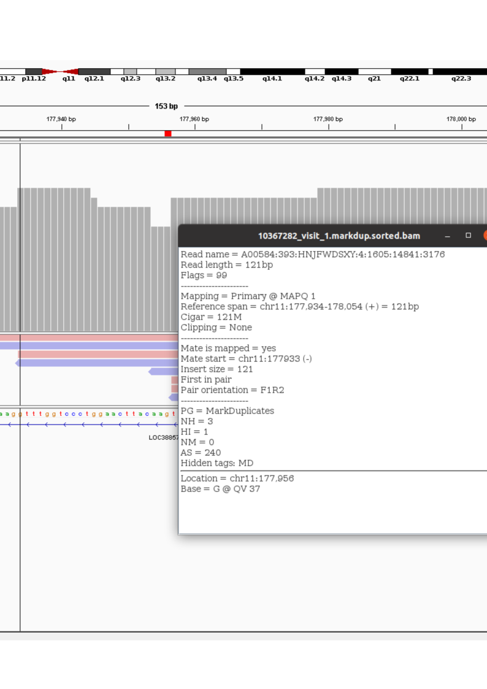

```{r, include = FALSE}
knitr::opts_chunk$set(
  collapse = TRUE,
  comment = "#>",
  eval = FALSE
)
```

```{r setup, eval = TRUE}
library(finalProject)
```

# Introduction

The Long Life Family Study is a genetics/genomics study of families 
who are identified by health records as long-lived. The study tracks family 
members over three generations in a series of three visits each. Each individual's 
genome is fully assembled to generate genotype data,
and the result of each of the three visits are measurements of a large number 
of phenotypes. One such phenotype measurement is whole blood RNA sequencing.

Unfortunately, a mishap has occurred in at least 15 of the RNA sequence
samples. These samples display a gene expression pattern which contrasts 
with the sex of the study subject to which the sample is attributed.

To attempt to resolve this, I hypothesize that there exists a set of SNPs which 
are located in highly and consistently expressed exons. For each individual 
genome, the genotype at each SNP locus will form a vector which, like a finger 
print, will uniquely identify individual genomes. I can then extract the 
consensus base, or bases in the case of heterozygous loci, from RNA sequence 
library alignments and quantify the hamming distance between 
the RNA sequence library genotype vector and all of the individual genome 
genotype vectors. The result will be a ranked list which may be used to 
correct the mislabeled samples in the study metadata.

The purpose of this project is to determine the feasibility of matching RNA 
sequencing libraries to individual genomes.

# Method

The genomes are assembled and genotyped in reference to human genome version hg38. 
A variant call file (VCF) exists for each genome which details all 
variants for each individual. Only high confidence single 
nucleotide polymorphisms over exonic regions are used for this project.

The RNA sequence reads are aligned with STAR, a splice aware aligner,
to the same reference genome. Samtools pileup was used to determine 
the aligned base and depth over the exome for each RNA sequence library. Only 
reads which have a high alignment score and a depth of at least 5 are used in
this project.  

There are 3,688 genes which are expressed at at least 10 log2 counts per 
million in all of the roundly 1000 samples which have been RNA sequenced thus 
far. Using these regions, which are distributed over all autosomal chromosomes, 
I created four genotype vectors (samples of SNP loci, in other words) of length
1,900 each. 

As proof of concept, I selected 7 of the mislabeled samples. Since there are 
two visits to the same individual, I selected both visit 1 and visit 2 for each 
for a total of 14 known mislabeled samples. If the sample is correctly 
identified to a given genome using the method I have outlined above, visit 1 
and visit 2 should agree as to which genome that is. I 
then selected visit 1 and visit 2 libraries for 3 other RNA sequencing samples 
to act as a control. These libraries pass all quality thresholds (all of the
mislabels also pass these thresholds), and are not known mislabels. 
Thus, there is a total of twenty RNA sequence libraries in this project, 
which will be compared against 4,556 individual genomes.

## Nitty Gritty

### Data Preparation

While it may seem trivial to extract this data, for me, at least, it was not. 
The genome data exists in 238 VCF files -- each chromosome is split into 
multiple chunks -- which average 4GB each. Reading these files into memory 
and extracting data is, time-wise, not feasible, nor is it logistically simple 
since each chromosome is split into at least 7 parts. As a result, it was not 
immediately clear how to extract and store the data to make experimentation 
possible.  

I initially tried to use [Plink](https://zzz.bwh.harvard.edu/plink/), 
which seems to be commonly used among the geneticists at Wash U. However, 
for my purposes, this did not provide the quick access to the data that that I 
needed. Simply extracting a SNP matrix (dimensions SNP by samples) ran for more 
than a day, and the output format was not useful.  

The solution I finally arrived at was to extract the data from the VCF files 
into a [SQLite database](https://sqlite.org/index.html). 
Using 
[VariantAnnotation](https://bioconductor.org/packages/release/bioc/html/VariantAnnotation.html), 
an R package, I could fine tune, for speed, how the data streams into my 
parsing program. I could also pre-filter the data so that only high quality 
SNPs are stored.

The table which stores the genome genotype data is called `sample_genotype`, 
and has the following fields: `sample`, `chr` (chromosome), 
`bp` (snp location, 1 indexed from the start to the end of the chromosome), 
`ref_alt` (reference genome genotype, and the alternate allele genotype, 
at that location, eg A/T), and `genotype` (three levels, A/A which 
represents homozygous reference, A/B which represents a heterzygous locus, 
and B/B for homozygous alternate). This table is indexed on `sample`, `chr` and 
`bp` for fast lookup.  

One useful feature of using a database framework is that I can also create 
views, or virtual tables defined by a SQL query of other tables in the database, 
which define the randomly sampled sets of loci to be used to match genomes to 
RNA sequence libraries. For example, the SQL command which creates the first sample looks like this:

```
DROP VIEW IF EXISTS "main"."sample1"; 
CREATE VIEW "sample1" AS 
SELECT * FROM sample_genotype 
WHERE (chr IS 13.0 AND bp BETWEEN 48975912 AND 49209779 OR
       ...
       chr IS 17.0 AND bp BETWEEN 50962174 AND 51120868 OR
       ...
       chr IS 19.0 AND bp BETWEEN 12995475 AND 13098796 OR
       ...
```

For each RNA sequence library, I used 
[Rsamtools](https://bioconductor.org/packages/release/bioc/html/Rsamtools.html), 
an R wrapper for
[Samtools](http://www.htslib.org/doc/samtools-mpileup.html), 
to 'pileup' the alignments from the bam files. Only those reads which met 
the criteria described below were retained in the pileup.

```{r}
# these are the paramters used as input to Rsamtools pileup. scanBamParam 
# and pileupParam are helper functions in Rsamtools which read SAM/BAM flags
# and tags and aid in filtering the alignments

sbp = 
  ScanBamParam(
    flag = 
                  # only count reads for which both R1 and R2 align properly 
                  # (these are reverse strand library, so R1 must align to the 
                  # reverse complement of the reference, while R2 aligns on the 
                  # forward strand with some specified overlap)
      scanBamFlag(isProperPair                = TRUE, 
                  # only accept primary alignments
                  isSecondaryAlignment        = FALSE,
                  isSupplementaryAlignment    = FALSE,
                  # only accept alignments which pass all aligner quality 
                  # metrics
                  isNotPassingQualityControls = FALSE))

p_param = 
              # only count to a depth of 1000 over any given locus (for speed, 
              # and it turned out that few individual bases had anywhere close 
              # to this depth)
  pileupParam(max_depth            = 1000, 
              # only retain in the output bases which have a depth of at least 5
              # reads
              min_nucleotide_depth = 5,
              # count reads from both strands over a given locus
              distinguish_strand   = FALSE,
              # only accept reads with a MAPQ (alignment quality) of at least 10
              min_mapq             = 10,
              # only accept reads with a sequencer quality score of at least 10
              min_base_quality     = 10)
```

### Sample preparation

The genome SNP variants are sampled from the previously identified 4000 highly and 
consistently expressed genes. the result, for one sample, looks like so:

```
> snp_df
# A tibble: 840 × 2
   chr         bp
   <chr>    <int>
 1 12.0  12500010
 2 12.0  12500075
 3 12.0  12500375
 4 12.0  12500383
 5 12.0  12500396
 6 12.0  12500480
 7 12.0  12500556
 8 12.0  12500807
 9 12.0  12500824
10 12.0  12500914
# … with 830 more rows
```
Sampling 1900 high expression genes results, for sample1, in 840 high confidence 
SNPS. A subset of a SNP vector (this one for subject labelled '8') looks like 
this:
```
> sample_genome_vectors$`8`
  [1] "G"         "G"         "G"         "C"         "G"        
  [6] "G"         "A"         "G"         "C"         "G"        
 [11] "G"         "G"         "T"         "G"         "A"        
 [16] "T"         "A"         "G"         "A"         "A"        
 [21] "A"         "T"         "A"         "G"         "G"        
 [26] "A"         "C"         "C"         "T"         "A"        
 [31] "T"         "T"         "C"         "T"         "C"        
 [36] "C"         "T"         "T"         "C"         "G"        
 [41] "C"         "C"         "A"         "G"         "T" 
 ...
```
An RNA sequence library vector looks like this:
```
> pileup_vector
  [1] "G"         "G"         "G"         "C"         "G"        
  [6] "G"         "A"         "G"         "C"         "G"        
 [11] "G"         "Uncertain" "Uncertain" "Uncertain" "Uncertain"
 [16] "Uncertain" "Uncertain" "Uncertain" "Uncertain" "Uncertain"
 [21] "Uncertain" "Uncertain" "Uncertain" "Uncertain" "Uncertain"
 [26] "A"         "Uncertain" "Uncertain" "Uncertain" "Uncertain"
 [31] "Uncertain" "T"         "Uncertain" "Uncertain" "C"        
 [36] "C"         "Uncertain" "Uncertain" "Uncertain" "Uncertain"
 [41] "C"         "Uncertain" "Uncertain" "Uncertain" "Uncertain"
 ...
```
A note here -- I was and am concerned about the number of uncertain bases. So, I
visualized this locus in this sample:

```{r echo=FALSE, eval = TRUE, fig.cap="Figure 1: An RNAseq library SNP locations", out.width = '75%'}

```
The vertical bar in figure 1 is over the first "Uncertain" locus in the 
alignment from which the pileup vector above originates. The detail box 
in the image gives details on one of the reads. It says the following: The read 
is 121 base pairs long. SAM flag 99 means that this read, along with its pair, 
are both mapped (the library is unstranded, so in this case, R1 maps to the 
forward strand while R2 maps to the reverse strand). This location is the 
primary alignment for this read, and it aligns without gaps (Cigar 121M means 
121 matches). There is no soft clipping at the ends of the read and the mate 
is also mapped.  

However, the mapping quality (MAPQ) is 1. That indicates that this 
alignment may occur with ~70% chance in other locations in the genome. And, 
this is the case: the flag NH:3 means that there are 3 other alignments which 
may be as good as this one.  

In looking more closely at this -- which I am doing as I write this report -- I 
realized that the more stringent MAPQ filter on the pileup step is likely not 
necessary. Rather, I should only set a base_quality score (currently the 
threshold I have set is also 10. The base quality score of this particular base 
is 37). For quantifying the counts over a given locus, it makes more sense to 
have a more stringent MAPQ threshold. However, for this purpose, it does not. 
A high quality multi-map does provide evidence of a given base's identity. In 
fact, it increases confidence. I will address this further in the Conclusions 
section.

Revising the Rsamtools pileup params to the following:

```{r}
  p_param =
    PileupParam(max_depth            = 250, 
                min_nucleotide_depth = 5,
                distinguish_strand   = FALSE,
                min_base_quality     = 10)

```
Which reduces the `max_depth`, since none of the positions had more than 95 
reads, and removes the MAPQ filter, results in a new pileup vector (same sample 
as the one above) which looks like this:

```

```
and reduces the number of 'Uncertain' positions by _____
### Distance

The hamming distance between an RNA sequence library SNP vector and an 
individual's genome SNP vector is calculated using one of the two 'scoring 
matricies'.

```{r eval = TRUE, echo=FALSE}
knitr::kable(equivalence_class_dist_matrix(lenient = FALSE), 
             caption = "Strict Scoring Matrix")
```

```{r eval = TRUE, echo=FALSE}
knitr::kable(equivalence_class_dist_matrix(lenient = TRUE), 
             caption = "Lenient Scoring Matrix")
```

# Results

```{r}
  con = dbConnect(RSQLite::SQLite(), "data/10367282.1.pileup")
  sql = paste0("CREATE INDEX idx_pileup 
ON rnaseq_pileup (chr, pos);")
  dbExecute(con, sql)
  dbDisconnect(con)
```
```{r}
sample = 'sample3'

snp_df = sample_snp_ranges(here("data/sample_genotype_db.sqlite"), sample)

sample_genome_vectors = genome_vectors(here("data/sample_genotype_db.sqlite"), 
                                       'sample1')

pileup_vector = rnaseq_vector(here("data/10367282.1.pileup"), snp_df)

dist_mat = equivalence_class_dist_matrix(lenient = TRUE)

out_list3 = map(sample_genome_vectors, compare_vectors, pileup_vector, dist_mat)
names(out_list3) = names(sample_genome_vectors)
```

```{r}
sample = 'sample1'

snp_df = sample_snp_ranges(here("data/sample_genotype_db.sqlite"), sample)

sample_genome_vectors = genome_vectors(here("data/sample_genotype_db.sqlite"), 
                                       sample)

pileup_vector = rnaseq_vector(here("data/10367282.1.pileup"), snp_df)

dist_mat = equivalence_class_dist_matrix(lenient = FALSE)

out_list1 = map(sample_genome_vectors, compare_vectors, pileup_vector, dist_mat)
names(out_list1) = names(sample_genome_vectors)
```

```{r}
highly_expressed_gene_virtual_table(gene_ranges,
                                    here("data/sample_genotype_db.sqlite"),
                                    "sample4")

sample = 'sample4'

snp_df = sample_snp_ranges(here("data/sample_genotype_db.sqlite"), sample)

sample_genome_vectors = genome_vectors(here("data/sample_genotype_db.sqlite"), 
                                       sample)

pileup_vector = rnaseq_vector(here("data/10367282.2.pileup"), snp_df)

dist_mat = equivalence_class_dist_matrix(lenient = FALSE)

out_list4 = map(sample_genome_vectors, compare_vectors, pileup_vector, dist_mat)
names(out_list4) = names(sample_genome_vectors)
```

```{r}
gene_ranges = readRDS(here("data/high_expr_genes.rds"))
sample_list = paste0("sample", seq(1,4))

map(sample_list, ~highly_expressed_gene_virtual_table(gene_ranges,
                                    here("data/sample_genotype_db.sqlite"),
                                    .))
```

```{r}

filename_map = read_csv(here("data/filename_id_subject_mislabel_map.csv")) %>%
  mutate(filename = 
           paste0(
             str_remove_all(filename, "_visit|.markdup.sorted.pileup"),
             '.sqlite')) %>%
  mutate(filename = str_replace(filename, "_", "."))


```

```{r}
experiment_res = map(sample_list, conduct_experiment, filename_map)
```

# References

https://seqqc.wordpress.com/2015/03/10/calculate-nucelotide-frequency-with-rsamtools-pileup/

# Misc


## mislabels

```
4307 , 1294 , 11221 , 20686 , 20903 , 26715 , 21389 , 25785 , 2333 , 6190 , 6099 , 11185 
```

## supposedly correctly labeled

```
31013 , 1597 , 8161 , 5582 , 15076 , 809 , 15147 , 14639 , 26794 , 13822, 2020,14444 
```
